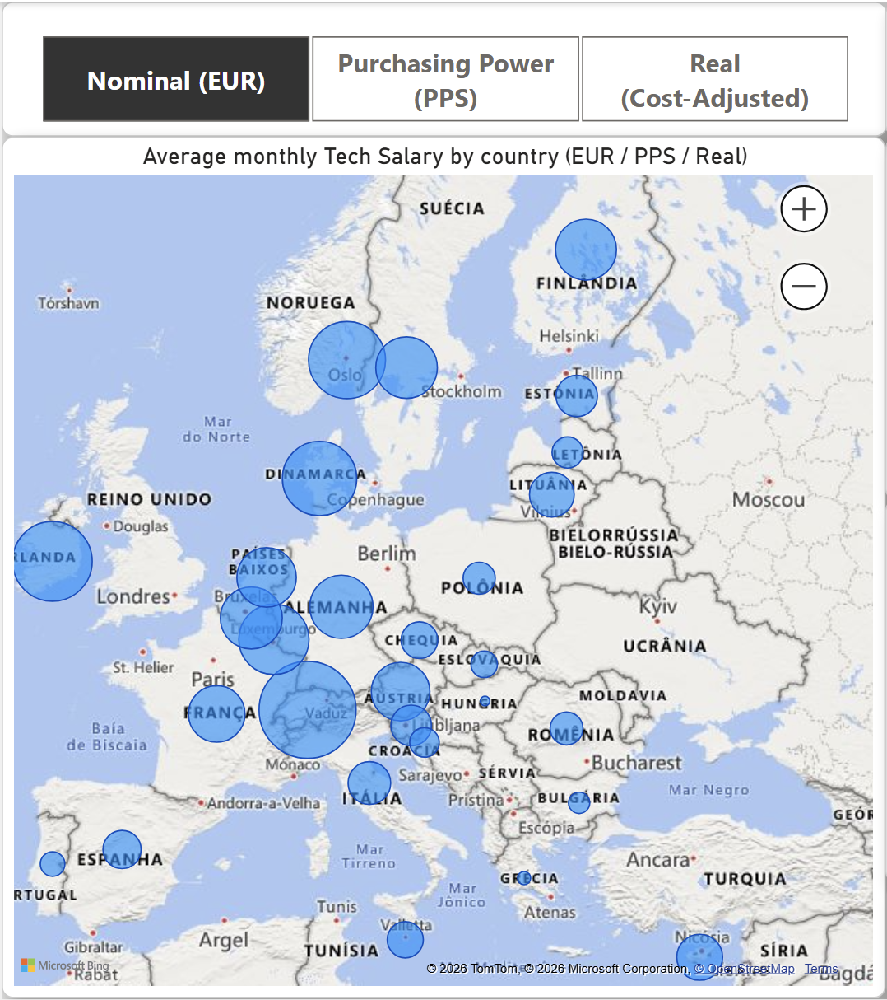
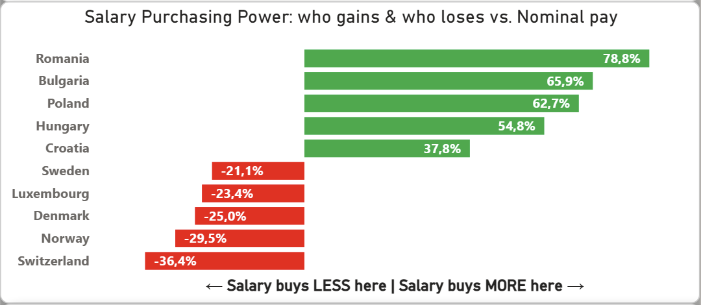
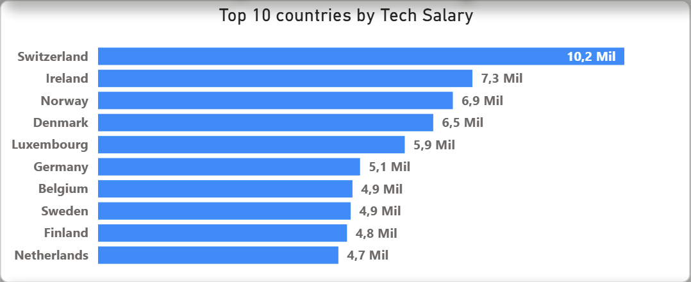

# 🇪🇺 EU Tech Salary Explorer

**Where do tech professionals actually earn the most in Europe — and where does that salary actually *stretch* the furthest?**


An interactive Power BI dashboard + Python data pipeline comparing **nominal tech salaries**, **purchasing-power-adjusted salaries**, and **cost of living** across 29 European countries — built on official Eurostat data and refreshed automatically every two weeks.

---

## 1. The question

Tech salary comparisons usually stop at "country X pays €Y more than country Z." That's misleading: a high nominal salary in an expensive country can buy *less* than a modest salary somewhere cheaper.

This project answers two questions side by side:
1. **Nominal:** which country pays the highest gross monthly salary in IT (NACE J — Information & Communication)?
2. **Real:** once you adjust for each country's price level, where does that salary actually go furthest?

---

## 2. Key insights (2022 salary data / 2024 price levels)

- **Switzerland tops both rankings** — €10,198/month nominal, and still #1 (€6,434 EUR-equivalent) after adjusting for its 158.5 price-level index, the highest in Europe.
- **Romania is the biggest mover.** Its nominal salary (€2,575) ranks #21, but adjusted for its low cost of living (PLI 75.5), it jumps to **#13 in real terms** — an 8-position climb, the largest of any country.
- **The Netherlands punches above its nominal rank**: #10 nominally (€4,657) but #7 once cost of living is factored in.
- **Estonia is the inverse case** — a relatively high nominal salary (#16, €3,078) falls to **#21 in real terms**, the steepest drop in the dataset, because its cost of living has caught up with its wages.
- **On average across all 29 countries, PPS-adjusted salaries run ~9.8% higher than nominal EUR salaries** — but the spread is huge: from **-36.4%** in Switzerland (your euro buys less than it looks like) to **+78.8%** in Romania (your euro buys far more than it looks like).

---

## 3. Dashboard

| Map (toggle EUR / PPS / Real) | Purchasing Power: who gains & who loses | Top 10 |
|---|---|---|
|  |  |  |

> *Built in Power BI Desktop. Open `powerbi/salary_explorer.pbix` and click Refresh to pull the latest data from `data/processed/salary_explorer.csv`.*

> **Design note:** an earlier version used a salary-vs-cost-of-living **scatter plot**. It was dropped mid-project: accurate, but slow to read for a non-technical audience. The diverging bar chart ("who gains & who loses") carries the same insight — adjusting for cost of living reshuffles the ranking — in a form anyone grasps at a glance. The layout fits only one of the two, so clarity won.

---

## 4. Architecture — two-layer auto-update

```
┌───────────────────────────────┐
│ Layer 1 — Data (Automatic)    │  GitHub Actions, 1st & 15th of each month
│ fetch_eurostat_salary.py      │ → Eurostat earn_ses22_20 (salaries, EUR + PPS)
│ fetch_oecd.py                 │ → Eurostat prc_ppp_ind   (price level indices)
│ build_dataset.py              │ → data/processed/salary_explorer.csv
└───────────────┬───────────────┘
                │
┌───────────────▼───────────────┐
│ Layer 2 — Report (Manual)     │  Open the .pbix and click Refresh to pull
│ powerbi/salary_explorer.pbix  │  the latest CSV. Full auto-refresh would
└───────────────────────────────┘  require Power BI Service.
```

---

## 5. Data sources

| Source | Dataset | What it provides |
|---|---|---|
| [Eurostat](https://ec.europa.eu/eurostat) | `earn_ses22_20` — Structure of Earnings Survey | Mean monthly gross earnings, IT sector (NACE J), in EUR and PPS |
| [Eurostat](https://ec.europa.eu/eurostat) | `prc_ppp_ind` — Price Level Indices | Price level index per country (EU27 = 100), used to compute "real" salary |

> Note: `fetch_oecd.py` was originally scoped to query OECD SDMX directly, but the project pivoted to Eurostat's PPP dataset (`prc_ppp_ind`) for consistency with the salary data and simpler automation — same price-level concept, single source.

### Future enrichment (not yet integrated)

A second, crowdsourced cost-of-living source such as [Numbeo](https://www.numbeo.com) could be layered in to cross-check the official Eurostat price levels — an "official vs. perceived" cost-of-living angle. It's deliberately left out for now to keep the pipeline **fully automated**: Numbeo restricts automated scraping and would require a manual CSV step, which would break the auto-update design.

---

## 6. Data dictionary

| Column | Description |
|---|---|
| `country` / `geo` | Country name / ISO-2 code |
| `salary_eur` | Mean monthly gross IT salary, nominal EUR (2022) |
| `salary_pps` | Mean monthly gross IT salary in Purchasing Power Standard (PPS) |
| `pli_latest` / `pli_year` | Price Level Index (EU27=100) and reference year (2024) |
| `salary_real` | `salary_eur` adjusted by `pli_latest` — "what your salary is worth in EU-average terms" |
| `eur_vs_pps_gap_pct` | `(salary_pps - salary_eur) / salary_eur * 100` — how much purchasing power differs from the nominal figure. Negative = your money buys *less* than the number suggests (expensive country); positive = it buys *more* (cheap country) |
| `salary_eur_annual` / `salary_pps_annual` / `salary_real_annual` | Monthly figures × 12 |
| `rank_eur` / `rank_real` | Country ranking by nominal vs. real salary |

---

## 7. Running it locally

```bash
git clone https://github.com/raimirsilva/eu-tech-salary-explorer.git
cd eu-tech-salary-explorer
python -m venv .venv && source .venv/bin/activate
pip install -r requirements.txt

python python/fetch_eurostat_salary.py
python python/fetch_oecd.py
python python/build_dataset.py
```

Then open `powerbi/salary_explorer.pbix` in Power BI Desktop and hit **Refresh**.

---

## 8. Automation

- **GitHub Actions** (`.github/workflows/update_data.yml`) runs on the **1st and 15th of every month**, plus on-demand via *Run workflow*.
- It re-fetches Eurostat salary and price-level data, rebuilds `salary_explorer.csv`, and commits the result automatically.
- The `.pbix` file does **not** refresh itself on GitHub — open it locally and click Refresh to pull the latest CSV. Fully automatic refresh would require Power BI Service/Pro.

---

## 9. About

Built by **Raimir Silva** — an end-to-end data project on the European tech market, from the automated Python pipeline to the Power BI dashboard.

📊 [LinkedIn](https://www.linkedin.com/in/raimirsilva) · 💻 [GitHub](https://github.com/raimirsilva)

<br>

---
---

<br>

# 🇪🇺 EU Tech Salary Explorer
### Salários de Tech na Europa: nominal vs. real

**Onde os profissionais de tech realmente ganham mais na Europa — e onde esse salário realmente *rende* mais?**

Um dashboard interativo em Power BI + pipeline de dados em Python comparando **salários nominais de tech**, **salários ajustados por poder de compra** e **custo de vida** em 29 países europeus — construído sobre dados oficiais do Eurostat e atualizado automaticamente a cada duas semanas.

---

## 1. A pergunta

Comparações de salário em tech geralmente param em "o país X paga €Y a mais que o país Z". Isso é enganoso: um salário nominal alto num país caro pode comprar *menos* do que um salário modesto num lugar mais barato.

Este projeto responde duas perguntas lado a lado:
1. **Nominal:** qual país paga o maior salário mensal bruto em TI (NACE J — Informação e Comunicação)?
2. **Real:** depois de ajustar pelo nível de preços de cada país, onde esse salário rende mais?

---

## 2. Principais insights (dados salariais de 2022 / níveis de preço de 2024)

- **A Suíça lidera os dois rankings** — €10.198/mês nominal, e ainda #1 (€6.434 em equivalente-EUR) depois de ajustar pelo seu índice de nível de preços de 158,5, o mais alto da Europa.
- **A Romênia é quem mais sobe.** Seu salário nominal (€2.575) está em #21, mas ajustado pelo baixo custo de vida (PLI 75,5) sobe para **#13 em termos reais** — uma escalada de 8 posições, a maior de qualquer país.
- **A Holanda rende acima do seu rank nominal**: #10 no nominal (€4.657), mas #7 quando o custo de vida entra na conta.
- **A Estônia é o caso inverso** — um salário nominal relativamente alto (#16, €3.078) cai para **#21 em termos reais**, a queda mais acentuada do conjunto, porque o custo de vida alcançou os salários.
- **Na média dos 29 países, salários ajustados por PPS ficam ~9,8% acima dos nominais em EUR** — mas a dispersão é enorme: de **-36,4%** na Suíça (seu euro compra menos do que aparenta) a **+78,8%** na Romênia (seu euro compra muito mais do que aparenta).

---

## 3. Dashboard

| Mapa (alterna EUR / PPS / Real) | Poder de compra: quem ganha & quem perde | Top 10 |
|---|---|---|
|  |  |  |

> *Feito no Power BI Desktop. Abra `powerbi/salary_explorer.pbix` e clique em Atualizar para puxar os dados mais recentes de `data/processed/salary_explorer.csv`.*

> **Nota de design:** uma versão anterior usava um **gráfico de dispersão** salário × custo de vida. Foi descartado no meio do projeto: apesar de preciso, era mais lento de ler para um público não-técnico. O gráfico de barras divergentes ("quem ganha & quem perde") entrega o mesmo insight — ajustar pelo custo de vida embaralha o ranking — de um jeito que qualquer pessoa capta num relance. O layout comporta só um dos dois, então a clareza venceu.

---

## 4. Arquitetura — auto-atualização em duas camadas

```
┌───────────────────────────────┐
│ Camada 1 — Dados (Automática) │  GitHub Actions, dias 1 e 15 de cada mês
│ fetch_eurostat_salary.py      │ → Eurostat earn_ses22_20 (salários, EUR + PPS)
│ fetch_oecd.py                 │ → Eurostat prc_ppp_ind   (níveis de preço)
│ build_dataset.py              │ → data/processed/salary_explorer.csv
└───────────────┬───────────────┘
                │
┌───────────────▼───────────────┐
│ Camada 2 — Relatório (Manual) │  Abra o .pbix e clique em Atualizar para puxar
│ powerbi/salary_explorer.pbix  │  o CSV. A atualização 100% automática exigiria
└───────────────────────────────┘  o Power BI Service.
```

---

## 5. Fontes de dados

| Fonte | Dataset | O que fornece |
|---|---|---|
| [Eurostat](https://ec.europa.eu/eurostat) | `earn_ses22_20` — Structure of Earnings Survey | Ganho mensal bruto médio, setor de TI (NACE J), em EUR e PPS |
| [Eurostat](https://ec.europa.eu/eurostat) | `prc_ppp_ind` — Price Level Indices | Índice de nível de preços por país (EU27 = 100), usado para calcular o salário "real" |

> Nota: o `fetch_oecd.py` foi originalmente pensado para consultar o OECD SDMX diretamente, mas o projeto migrou para o dataset de PPP do Eurostat (`prc_ppp_ind`) por consistência com os dados salariais e automação mais simples — mesmo conceito de nível de preços, fonte única.

### Enriquecimento futuro (ainda não integrado)

Uma segunda fonte de custo de vida colaborativa, como o [Numbeo](https://www.numbeo.com), poderia ser somada para cruzar com os níveis de preço oficiais do Eurostat — um ângulo de "oficial vs. percebido". Foi deixada de fora por ora para manter o pipeline **100% automático**: o Numbeo restringe coleta automatizada e exigiria um passo manual de CSV, o que quebraria o design de auto-atualização.

---

## 6. Dicionário de dados

| Coluna | Descrição |
|---|---|
| `country` / `geo` | Nome do país / código ISO-2 |
| `salary_eur` | Salário mensal bruto médio em TI, nominal em EUR (2022) |
| `salary_pps` | Salário mensal bruto médio em TI, em Padrão de Poder de Compra (PPS) |
| `pli_latest` / `pli_year` | Índice de Nível de Preços (EU27=100) e ano de referência (2024) |
| `salary_real` | `salary_eur` ajustado por `pli_latest` — "quanto seu salário vale em termos da média da UE" |
| `eur_vs_pps_gap_pct` | `(salary_pps - salary_eur) / salary_eur * 100` — quanto o poder de compra difere do valor nominal. Negativo = seu dinheiro compra *menos* do que o número sugere (país caro); positivo = compra *mais* (país barato) |
| `salary_eur_annual` / `salary_pps_annual` / `salary_real_annual` | Valores mensais × 12 |
| `rank_eur` / `rank_real` | Ranking dos países por salário nominal vs. real |

---

## 7. Rodando localmente

```bash
git clone https://github.com/raimirsilva/eu-tech-salary-explorer.git
cd eu-tech-salary-explorer
python -m venv .venv && source .venv/bin/activate
pip install -r requirements.txt

python python/fetch_eurostat_salary.py
python python/fetch_oecd.py
python python/build_dataset.py
```

Depois abra `powerbi/salary_explorer.pbix` no Power BI Desktop e clique em **Atualizar**.

---

## 8. Automação

- O **GitHub Actions** (`.github/workflows/update_data.yml`) roda nos **dias 1 e 15 de cada mês**, além de sob demanda via *Run workflow*.
- Ele busca os dados de salário e nível de preços do Eurostat, reconstrói o `salary_explorer.csv` e commita o resultado automaticamente.
- O arquivo `.pbix` **não** se atualiza sozinho no GitHub — abra-o localmente e clique em Atualizar para puxar o CSV mais recente. Atualização totalmente automática exigiria o Power BI Service/Pro.

---

## 9. Sobre

Feito por **Raimir Silva** - um projeto de dados de ponta a ponta sobre o mercado europeu de tech, do pipeline automatizado em Python ao dashboard em Power BI.

📊 [LinkedIn](https://www.linkedin.com/in/raimirsilva) · 💻 [GitHub](https://github.com/raimirsilva)
